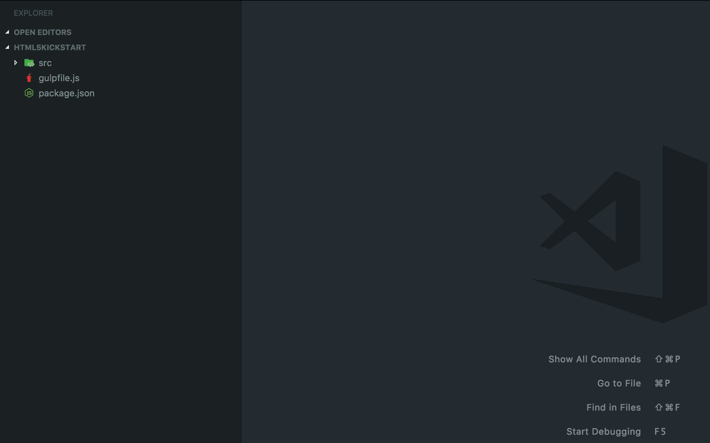
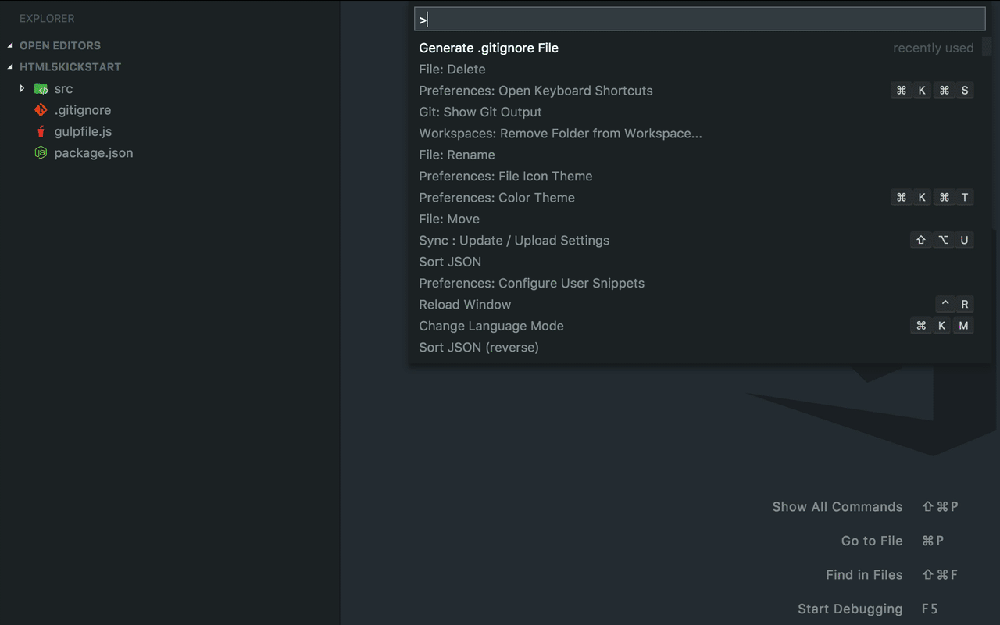

    

    <a href="https://marketplace.visualstudio.com/items?itemName=piotrpalarz.vscode-gitignore-generator">View in Visual Studio Code Marketplace</a>

# .gitignore Generator for _Visual Studio Code_

Lets you easily and quickly generate `.gitignore` file for your project using [gitignore.io](https://gitignore.io) API.

**Features:**

*   **easy to use**
*   **smart** - lets you update existing `.gitignore` file
*   **custom rules** - preserves user-defined rules upon update
*   **lightweight** - no external dependencies!

## Why do I need that?

Did you know that your operating system can store a lot of hidden files in every directory you create? How about `.DS_Store` or `Icon?` on macOS or `Thumbs.db` and `Desktop.ini` on Windows? These are certainly not the files you want to commit to a Git repository.

And what about other files and directories used by various frameworks and tools? These may be `node_modules` for Node.js or `vendors` for PHP projects using Composer. And this is only the tip of the iceberg, so you can't possibly know every file that should be excluded from being commited to a repository.

That's where [gitignore.io](https://gitignore.io) API comes in handy. It allows you to pick and choose tools, frameworks or operating system you're working with and it generates `.gitignore` file containing all the exclusions you need for those. You can, of course, use the website manually and then save the generated `.gitignore` file but leaving your editor to do just that is counterproductive.

**Using this extension for _Visual Studio Code_ you can achieve exactly that without ever leaving the editor (or even touching a mouse).**

## Installation

To install this extension go to `View->Extensions` and search for `.gitignore Generator`. Next click **Install** and then **Reload**.

## Usage

The main purpose of this extension is to generate `.gitignore` file but it's also smart enough to know if you already have one or if you added your custom rules to it. It's also OS-aware so it prechecks that checkbox for you.

To use the extension go to the **Command Palette** (`Shift+CMD+P` on macOS or `Shift+CTRL+P` on Windows) and launch `Generate .gitignore File` command.

### Case 1: You don't have .gitignore file yet

If you don't have `.gitignore` file already you'll be prompted right away with the list of all available tools, frameworks etc. to choose from. You can select or deselect the item with `Space` or by clicking the checkbox. Fuzzy-search is also available to speed things up.

Once you finished press Return (`Enter`) and your `.gitignore` file will be generated and saved on the disk.

### Case 2: You already have .gitignore file generated by this extension

If you generated `.gitignore` file before you'll be asked if you want to override it entirely or just update it. If you choose former option everything goes like described in **Case 1**. If you choose **Update**, all previously chosen items will be checked automatically so you don't have to do it again. Now you can choose other technologies or remove ones that you already have selected but don't want to use anymore.

### User-defined rules

The cool thing is that using this extension doesn't mean that you can't put your own exclusion rules in `.gitignore` file for fear of loosing them when you run **Update** command again.

Everything you put under `# Custom rules ...` (at the bottom of the file) will be preserved on the next update.

> **Warning!** If you choose **Override** option your custom rules will be lost.

### Multi-folder workspace

If you have more than one folder open in the workspace you'll be asked which one to use to generate `.gitignore` file into or update that file from.

## Available commands

Currently only one command is available:

*   `extension.gitignoreGenerate` (same as **Generate .gitignore File** in Command Palette)

By default, it's not bound to any keyboard shorcut but you're free to do so.

## Roadmap

Although this extension works well I'm planning to add some extra features to it in the future. Some of them are:

*   smart picker based on your project's files (i.e. checks **node** if you have `package.json` file)
*   custom rules picker (to save your own set of rules as an item to choose later)
*   `.gitignore` syntax highlighting

## Issues

If you find any problems using this extension or you want to propose new features to it, feel free to open an issue on [Github](https://github.com/piotrpalarz/vscode-gitignore-generator/issues).

## Credits

This project wouldn't be possible without already great [gitignore.io](https://gitignore.io) API created by **Joe Blau** ([@joe_blau](https://twitter.com/joe_blau)). Thanks!
